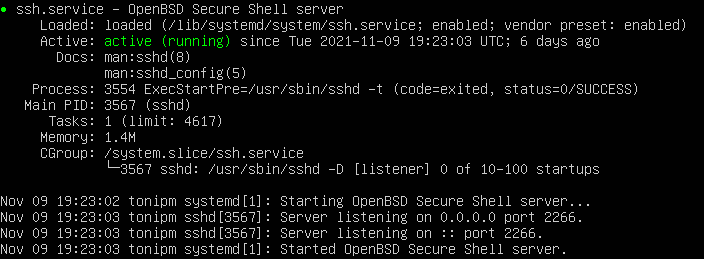

# Autenticació contra servers  <!-- omit in toc -->

Genera i utilitza diferents certificats digitals com a mitjà d'accés a un servidor remot.


# Índex <!-- omit in toc -->
- [Instal·la un servei ssh en un Ubuntu server virual machine](#installa-un-servei-ssh-en-un-ubuntu-server-virual-machine)
- [Utilitza una màquina client (pot ser virtual o real) per generar un parell de claus RSA o utilitza'n alguna que ja tinguis generada](#utilitza-una-màquina-client-pot-ser-virtual-o-real-per-generar-un-parell-de-claus-rsa-o-utilitzan-alguna-que-ja-tinguis-generada)
- [Instal·la la clau pública al servidor que té el servei ssh](#installa-la-clau-pública-al-servidor-que-té-el-servei-ssh)
- [Configura el servei ssh per tal que només es pugui fer login mitjançant claus RSA](#configura-el-servei-ssh-per-tal-que-només-es-pugui-fer-login-mitjançant-claus-rsa)
- [Configura el client per tal que s'autentiqui automàticament mitjançant el fitxer config](#configura-el-client-per-tal-que-sautentiqui-automàticament-mitjançant-el-fitxer-config)
## Instal·la un servei ssh en un Ubuntu server virual machine

```
sudo apt-get install openssh-server

sudo systemctl enable ssh

sudo systemctl start ssh

systemctl status ssh
```




## Utilitza una màquina client (pot ser virtual o real) per generar un parell de claus RSA o utilitza'n alguna que ja tinguis generada

```
ssh-keygen -t rsa -b 4096 
```

*`
SHA256:XzpX65xJin6i0sMQAFntFxP0d/sv3pNzfy1SXIc6DyE
`*


## Instal·la la clau pública al servidor que té el servei ssh

```
ssh-copy-id -i ~/.ssh/server_auth tonipm@192.168.2.169
```


```
ssh tonipm@192.168.2.169
```


## Configura el servei ssh per tal que només es pugui fer login mitjançant claus RSA

Editarem línies de configuració del servidor SSH.

```
sudo vi /etc/ssh/sshd_config
```
Editem la línia:

```
PasswordAuthentication yes
```

La canviem per:

```
PasswordAuthentication no
```
---
De passada també he canviat el port per seguretat. He editat la línia:

```
#Port 22
```

Per:

```
Port 2266
```
---
Reiniciem el servei:

```
sudo systemctl restart ssh
```

## Configura el client per tal que s'autentiqui automàticament mitjançant el fitxer config

```
vi ~/.ssh/config
```
```
Host konoha
	Hostname 192.168.2.169
	Port 2266
	User tonipm
	IdentityFile ~/.ssh/server_auth
```


Ara podem entrar simplement amb:

```
ssh konoha
```

