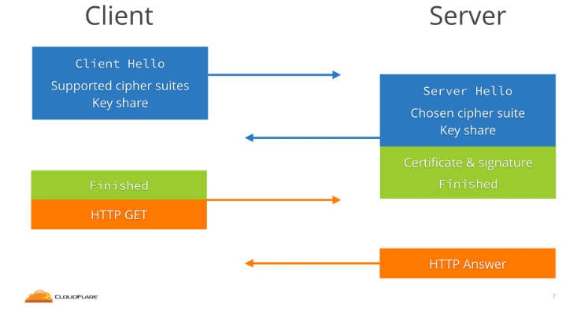
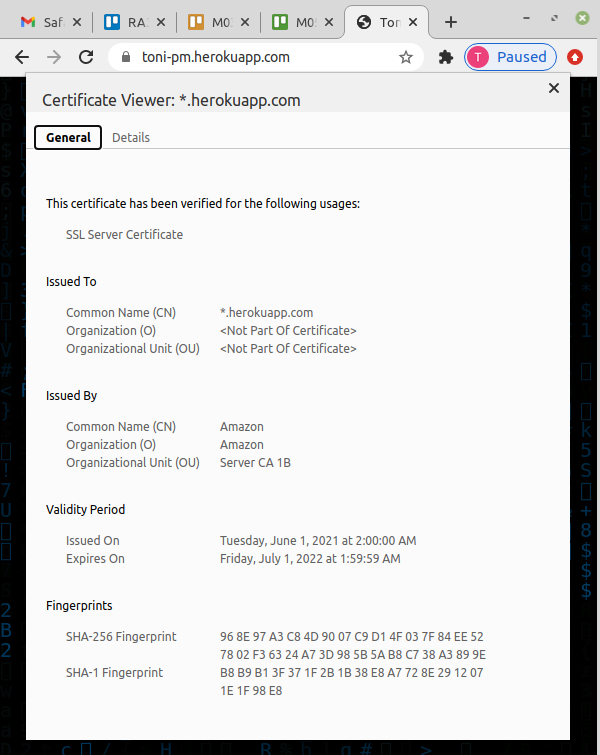
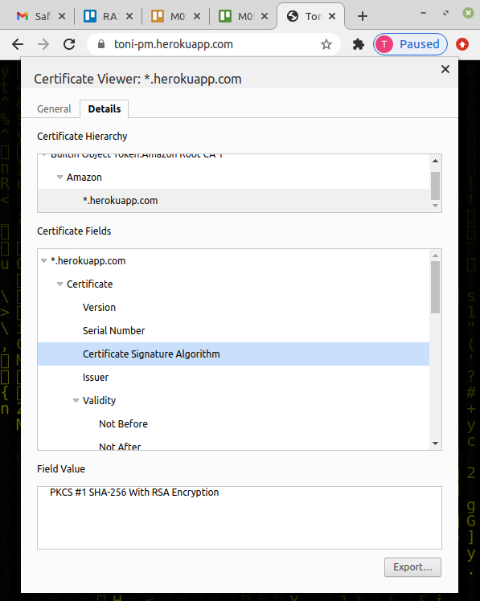
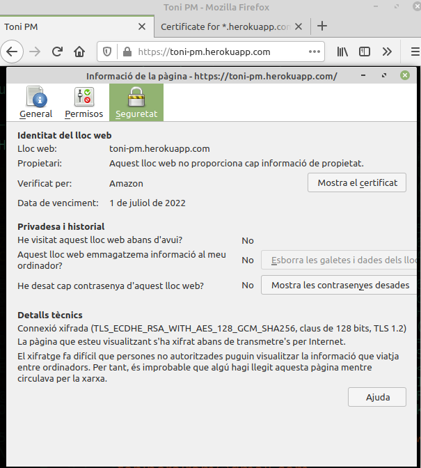
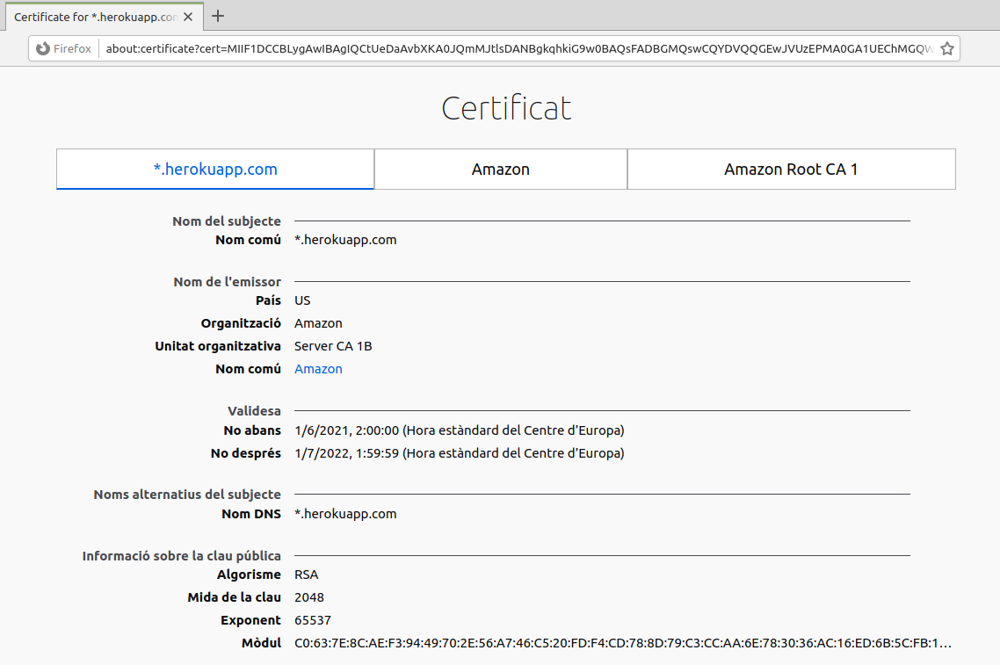
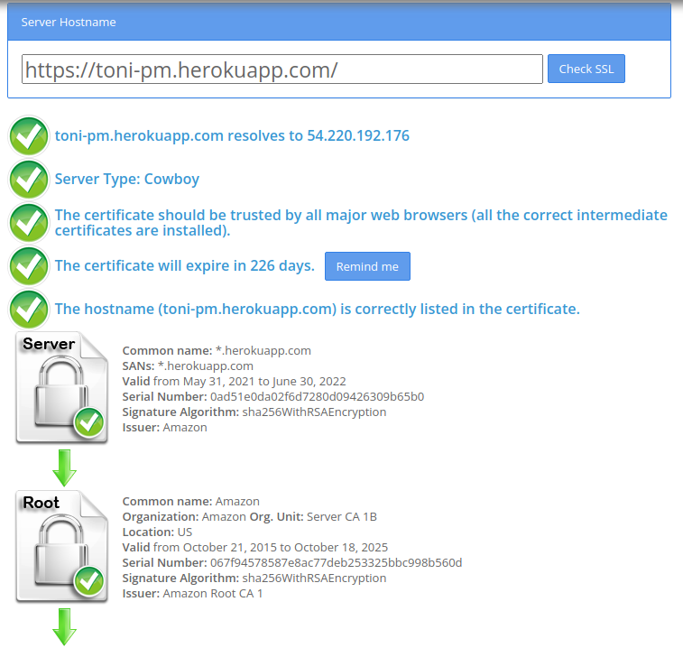
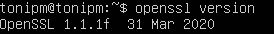
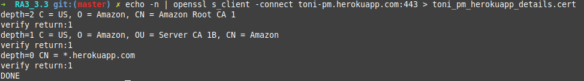
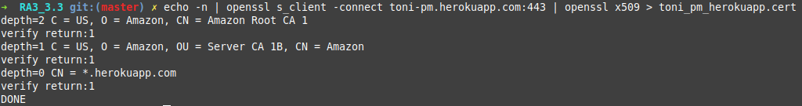

# Certificate validation <!-- omit in toc -->

Comprova la validesa i l'autenticitat d'un certificat digital d'un servei web.

# Índex <!-- omit in toc -->
- [Com funciona l'encriptació utilitzada per la última versió de TLS](#com-funciona-lencriptació-utilitzada-per-la-última-versió-de-tls)
- [Visita un lloc web i explica on podem trobar el seu certificat digital que ens permet navegar de forma segura.](#visita-un-lloc-web-i-explica-on-podem-trobar-el-seu-certificat-digital-que-ens-permet-navegar-de-forma-segura)
- [Instal·la openssl al teu servidor o verifica que estigui instal·lat i la seva versió](#installa-openssl-al-teu-servidor-o-verifica-que-estigui-installat-i-la-seva-versió)
- [Utilitza openssl per descarregar-te un certificat digital públic d'una web en concret, fent ús del **recurs de stack overflow** podràs deduir com fer-ho.](#utilitza-openssl-per-descarregar-te-un-certificat-digital-públic-duna-web-en-concret-fent-ús-del-recurs-de-stack-overflow-podràs-deduir-com-fer-ho)

## Com funciona l'encriptació utilitzada per la última versió de TLS

L'última versió del protocol TLS és la 1.3. Aquest protocol ens permet xifrar la comunicació entre un client i un servidor per tal d'assegurar la connexió.

Exemple de com funciona:

* Entro a la pàgina [https://toni-pm.herokuapp.com/](https://toni-pm.herokuapp.com/) amb HTTPS i el servidor m'envia un certificat amb la clau pública, aquest certificat inclou les dades d'identificació del lloc web.

* El meu navegador comprova i valida el certificat (qui ho envia, caducitat, etc) i crea una clau simètrica.

* S'envia una petició al servidor amb aquesta clau simètrica i el servidor la desxifra fent servir la seva clau privada. A partir d'aquí es genera una clau de sessió amb la qual es xifrarà la comunicació.

* Rebo la clau de sessió amb la qual el meu navegador ja pot enviar les dades de forma xifrada.

\
És a dir, les dades es xifren fent servir claus simètriques però la clau de sessió s'envia fent servir criptografia asimètrica.
El motiu pel qual es fa amb les simètriques és perquè és més ràpid de desxifrar i la comunicació serà més ràpida.


Imatge extreta de [CLOUDFLARE](https://blog.cloudflare.com/tls-1-3-overview-and-q-and-a/#:~:text=In%20TLS%201.3%20a%20client,agreement%20algorithm%20%22cipher%20suite%22.).

## Visita un lloc web i explica on podem trobar el seu certificat digital que ens permet navegar de forma segura.

El certificat digital el podem trobar fent click sobre el candau que hi ha al costat de l'adreça del navegador.

Chrome:





Firefox:





També podem fer servir la web [https://www.sslshopper.com/ssl-checker.html](https://www.sslshopper.com/ssl-checker.html) per validar les dades del certificat:



## Instal·la openssl al teu servidor o verifica que estigui instal·lat i la seva versió

Ja tinc instal·lat OpenSSL al servidor, podem verificar que està instal·lat i quina és la seva versió amb:

```
openssl version
```



## Utilitza openssl per descarregar-te un certificat digital públic d'una web en concret, fent ús del **recurs de stack overflow** podràs deduir com fer-ho.

Descarregar el certificat amb tots els detalls i la informació de la cadena de certificat:

```
echo -n | openssl s_client -connect toni-pm.herokuapp.com:443 > toni_pm_herokuapp_details.cert
```



```
cat toni_pm_herokuapp_details.cert

CONNECTED(00000003)
---
Certificate chain
 0 s:CN = *.herokuapp.com
   i:C = US, O = Amazon, OU = Server CA 1B, CN = Amazon
 1 s:C = US, O = Amazon, OU = Server CA 1B, CN = Amazon
   i:C = US, O = Amazon, CN = Amazon Root CA 1
 2 s:C = US, O = Amazon, CN = Amazon Root CA 1
   i:C = US, ST = Arizona, L = Scottsdale, O = "Starfield Technologies, Inc.", CN = Starfield Services Root Certificate Authority - G2
 3 s:C = US, ST = Arizona, L = Scottsdale, O = "Starfield Technologies, Inc.", CN = Starfield Services Root Certificate Authority - G2
   i:C = US, O = "Starfield Technologies, Inc.", OU = Starfield Class 2 Certification Authority
---
Server certificate
-----BEGIN CERTIFICATE-----
MIIF1DCCBLygAwIBAgIQCtUeDaAvbXKA0JQmMJtlsDANBgkqhkiG9w0BAQsFADBG
MQswCQYDVQQGEwJVUzEPMA0GA1UEChMGQW1hem9uMRUwEwYDVQQLEwxTZXJ2ZXIg
Q0EgMUIxDzANBgNVBAMTBkFtYXpvbjAeFw0yMTA2MDEwMDAwMDBaFw0yMjA2MzAy
MzU5NTlaMBoxGDAWBgNVBAMMDyouaGVyb2t1YXBwLmNvbTCCASIwDQYJKoZIhvcN
AQEBBQADggEPADCCAQoCggEBAMBjfoyu85RJcC5Wp0bFIP30zXiNecPMqm54MDas
Fu1rXPse7115bgsNdvVB2jS+wvJTvG9rWJWGvDvtorqsr+xwE9R6eMnHIylH6X1S
g1quM4+b8cW0lfX0z7IRc2jCbhh+/Y8+4UFtx4yGV38YHSxUNMusopMgA5z39Hbt
mT2kOLDnw5W47kUHHiwdnS890YFwkw3bgIVk797U7Jz8Xv7YUGSexKaNfE+9sNGc
XvWwnyEGtMSZo7OpweUXJlcmUgqDUgAIvZDvLTDUeMRbtHVnulDJY1R3Et3aLPlb
e75eAcjNpSuYSzEgi5P9RVOEF94wTrx8i3efz5Dr70AOLwECAwEAAaOCAugwggLk
MB8GA1UdIwQYMBaAFFmkZgZSoHuVkjyjlAcnlnRb+T3QMB0GA1UdDgQWBBT2tW38
mgpdScJ5c4zhgjdzTM1puTAaBgNVHREEEzARgg8qLmhlcm9rdWFwcC5jb20wDgYD
VR0PAQH/BAQDAgWgMB0GA1UdJQQWMBQGCCsGAQUFBwMBBggrBgEFBQcDAjA7BgNV
HR8ENDAyMDCgLqAshipodHRwOi8vY3JsLnNjYTFiLmFtYXpvbnRydXN0LmNvbS9z
Y2ExYi5jcmwwEwYDVR0gBAwwCjAIBgZngQwBAgEwdQYIKwYBBQUHAQEEaTBnMC0G
CCsGAQUFBzABhiFodHRwOi8vb2NzcC5zY2ExYi5hbWF6b250cnVzdC5jb20wNgYI
KwYBBQUHMAKGKmh0dHA6Ly9jcnQuc2NhMWIuYW1hem9udHJ1c3QuY29tL3NjYTFi
LmNydDAMBgNVHRMBAf8EAjAAMIIBfgYKKwYBBAHWeQIEAgSCAW4EggFqAWgAdwBG
pVXrdfqRIDC1oolp9PN9ESxBdL79SbiFq/L8cP5tRwAAAXnIm8mRAAAEAwBIMEYC
IQDz75isqcjT1SmqVuekemyzefK3tBrIKHH+erPe7TxGIgIhAL95i8ZSxQ17dFD7
6zp5VYwZSS+cRrC5oPu4X/eIanPhAHUAIkVFB1lVJFaWP6Ev8fdthuAjJmOtwEt/
XcaDXG7iDwIAAAF5yJvJEgAABAMARjBEAiAXNbqWMjUWQHAKtwxstYeM0Ab4zA6/
P9BfJzFK7RaC8wIgP5dybupQ0UPm1+61I+hjEnv9uM3qHnsxA2M27s8fuocAdgBR
o7D1/QF5nFZtuDd4jwykeswbJ8v3nohCmg3+1IsF5QAAAXnIm8lSAAAEAwBHMEUC
IQDxUkpMShSIyhSgkYSSca7+XS5DjXjFFwUHkv8hiatj3wIgUWLkG092g2lDe2ox
ZFpGSB+BLmR0PHc3WPNEnKQxGqYwDQYJKoZIhvcNAQELBQADggEBAH4B5ysZQQh9
1gEyX/HHsCtOmIEwL5tRlV6lPUuF9xs8WdPio+B60q5dw4ZeXVwmysDgyo1aAfCC
FHBLnl6INjg3W70G4VDwIXzEmyjjm51lj+DLIIPFlzAF8Rtp7uCMmSO48OW3G/9g
Tqj0V9phET7N3GnNrfUttfB7s9/UAhkbk5r9Vd/Nh5a8f6pEPWN6JbPQNqgqSCx6
Q2FXc7HylhDNQgoxklg8LqVR+3nG0Gpi5NCb2STuU9l9f8EricpwZxhBNcdtmx0+
SsmBHwVfJSMf2n774KiQPv0EGFSROExU6XAJjPLhSvzeFhNr0WJUYFfPr06kUhiT
PdbBFFybL2Q=
-----END CERTIFICATE-----
subject=CN = *.herokuapp.com

issuer=C = US, O = Amazon, OU = Server CA 1B, CN = Amazon

---
No client certificate CA names sent
Peer signing digest: SHA256
Peer signature type: RSA
Server Temp Key: ECDH, P-256, 256 bits
---
SSL handshake has read 5557 bytes and written 439 bytes
Verification: OK
---
New, TLSv1.2, Cipher is ECDHE-RSA-AES128-GCM-SHA256
Server public key is 2048 bit
Secure Renegotiation IS supported
Compression: NONE
Expansion: NONE
No ALPN negotiated
SSL-Session:
    Protocol  : TLSv1.2
    Cipher    : ECDHE-RSA-AES128-GCM-SHA256
    Session-ID: 7F68B667152749F3DD106D33C808B0AE63FC183FE45D0A8661205B43A5027910
    Session-ID-ctx: 
    Master-Key: 7C8126037C13E651DFBABF1DAA4C0BFC520E023BC776B8ECEC5530F6498DFDB892D2CDA8494ACACE10C77B0C7C1A8F25
    PSK identity: None
    PSK identity hint: None
    SRP username: None
    TLS session ticket lifetime hint: 172800 (seconds)
    TLS session ticket:
    0000 - 53 53 4b 2d 45 30 30 34-35 34 37 33 35 00 00 00   SSK-E00454735...
    0010 - 57 33 6e 39 4e 27 c2 db-51 66 84 29 97 75 85 dd   W3n9N'..Qf.).u..
    0020 - 13 5d b0 b7 b2 81 55 10-45 be fc bf 3a bd 9f 6c   .]....U.E...:..l
    0030 - 43 80 8f 21 c7 db 78 ad-44 69 38 b2 e6 f2 19 71   C..!..x.Di8....q
    0040 - 95 be 78 f7 9a 52 e4 1c-28 d5 29 8a 6a 65 d6 04   ..x..R..(.).je..
    0050 - cd 53 48 39 d3 71 6d ce-aa df e9 c8 bc 5a 11 db   .SH9.qm......Z..
    0060 - 3f cd df 2c 4e a3 e4 8d-                          ?..,N...

    Start Time: 1637090819
    Timeout   : 7200 (sec)
    Verify return code: 0 (ok)
    Extended master secret: no
---

```
---
Descarregar el certificat sense els detalls ni la informació de la cadena de certificat.
```
echo -n | openssl s_client -connect toni-pm.herokuapp.com:443 | openssl x509 > toni_pm_herokuapp.cert
```



```
cat toni_pm_herokuapp.cert

-----BEGIN CERTIFICATE-----
MIIF1DCCBLygAwIBAgIQCtUeDaAvbXKA0JQmMJtlsDANBgkqhkiG9w0BAQsFADBG
MQswCQYDVQQGEwJVUzEPMA0GA1UEChMGQW1hem9uMRUwEwYDVQQLEwxTZXJ2ZXIg
Q0EgMUIxDzANBgNVBAMTBkFtYXpvbjAeFw0yMTA2MDEwMDAwMDBaFw0yMjA2MzAy
MzU5NTlaMBoxGDAWBgNVBAMMDyouaGVyb2t1YXBwLmNvbTCCASIwDQYJKoZIhvcN
AQEBBQADggEPADCCAQoCggEBAMBjfoyu85RJcC5Wp0bFIP30zXiNecPMqm54MDas
Fu1rXPse7115bgsNdvVB2jS+wvJTvG9rWJWGvDvtorqsr+xwE9R6eMnHIylH6X1S
g1quM4+b8cW0lfX0z7IRc2jCbhh+/Y8+4UFtx4yGV38YHSxUNMusopMgA5z39Hbt
mT2kOLDnw5W47kUHHiwdnS890YFwkw3bgIVk797U7Jz8Xv7YUGSexKaNfE+9sNGc
XvWwnyEGtMSZo7OpweUXJlcmUgqDUgAIvZDvLTDUeMRbtHVnulDJY1R3Et3aLPlb
e75eAcjNpSuYSzEgi5P9RVOEF94wTrx8i3efz5Dr70AOLwECAwEAAaOCAugwggLk
MB8GA1UdIwQYMBaAFFmkZgZSoHuVkjyjlAcnlnRb+T3QMB0GA1UdDgQWBBT2tW38
mgpdScJ5c4zhgjdzTM1puTAaBgNVHREEEzARgg8qLmhlcm9rdWFwcC5jb20wDgYD
VR0PAQH/BAQDAgWgMB0GA1UdJQQWMBQGCCsGAQUFBwMBBggrBgEFBQcDAjA7BgNV
HR8ENDAyMDCgLqAshipodHRwOi8vY3JsLnNjYTFiLmFtYXpvbnRydXN0LmNvbS9z
Y2ExYi5jcmwwEwYDVR0gBAwwCjAIBgZngQwBAgEwdQYIKwYBBQUHAQEEaTBnMC0G
CCsGAQUFBzABhiFodHRwOi8vb2NzcC5zY2ExYi5hbWF6b250cnVzdC5jb20wNgYI
KwYBBQUHMAKGKmh0dHA6Ly9jcnQuc2NhMWIuYW1hem9udHJ1c3QuY29tL3NjYTFi
LmNydDAMBgNVHRMBAf8EAjAAMIIBfgYKKwYBBAHWeQIEAgSCAW4EggFqAWgAdwBG
pVXrdfqRIDC1oolp9PN9ESxBdL79SbiFq/L8cP5tRwAAAXnIm8mRAAAEAwBIMEYC
IQDz75isqcjT1SmqVuekemyzefK3tBrIKHH+erPe7TxGIgIhAL95i8ZSxQ17dFD7
6zp5VYwZSS+cRrC5oPu4X/eIanPhAHUAIkVFB1lVJFaWP6Ev8fdthuAjJmOtwEt/
XcaDXG7iDwIAAAF5yJvJEgAABAMARjBEAiAXNbqWMjUWQHAKtwxstYeM0Ab4zA6/
P9BfJzFK7RaC8wIgP5dybupQ0UPm1+61I+hjEnv9uM3qHnsxA2M27s8fuocAdgBR
o7D1/QF5nFZtuDd4jwykeswbJ8v3nohCmg3+1IsF5QAAAXnIm8lSAAAEAwBHMEUC
IQDxUkpMShSIyhSgkYSSca7+XS5DjXjFFwUHkv8hiatj3wIgUWLkG092g2lDe2ox
ZFpGSB+BLmR0PHc3WPNEnKQxGqYwDQYJKoZIhvcNAQELBQADggEBAH4B5ysZQQh9
1gEyX/HHsCtOmIEwL5tRlV6lPUuF9xs8WdPio+B60q5dw4ZeXVwmysDgyo1aAfCC
FHBLnl6INjg3W70G4VDwIXzEmyjjm51lj+DLIIPFlzAF8Rtp7uCMmSO48OW3G/9g
Tqj0V9phET7N3GnNrfUttfB7s9/UAhkbk5r9Vd/Nh5a8f6pEPWN6JbPQNqgqSCx6
Q2FXc7HylhDNQgoxklg8LqVR+3nG0Gpi5NCb2STuU9l9f8EricpwZxhBNcdtmx0+
SsmBHwVfJSMf2n774KiQPv0EGFSROExU6XAJjPLhSvzeFhNr0WJUYFfPr06kUhiT
PdbBFFybL2Q=
-----END CERTIFICATE-----
```
