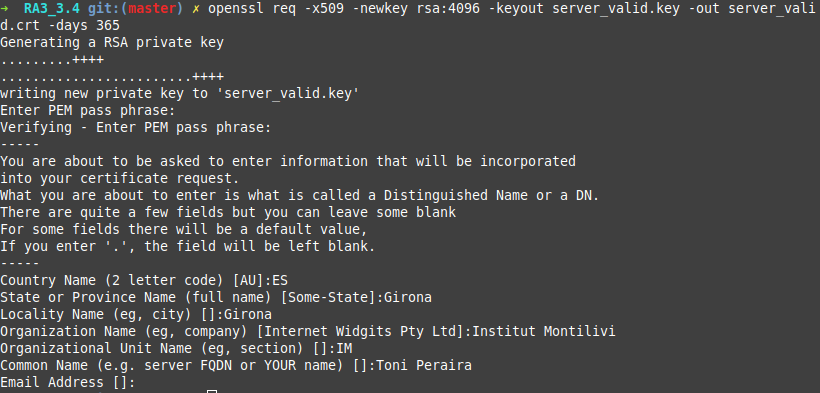

<!-----
title: "Certificats digitals vàlids i invàlids"
author: "Toni Peraira"
date: "2021-11-23"
version: "1.0"
geometry: left=2.54cm,right=2.54cm,top=2.54cm,bottom=2.54cm
header-right: '\headerlogo'
header-includes:
- '`\newcommand{\headerlogo}{\raisebox{0pt}[0pt]{\includegraphics[width=3cm]{../institut_montilivi.png}}}`{=latex}'
---

pandoc README.md -o Toni_Peraira_RA3_3.4.pdf --from markdown --template eisvogel --listings --pdf-engine=xelatex --toc -s -V toc-title:"Índex"
-->

# Compara certificats digitals vàlids i invàlids per diferents motius.

Primer de tot, per poder comparar certificats digitals vàlids amb invàlids hem de poder tenir certificats invàlids. 

## Fes servir el paquet 'faketime' per poder realitzar instruccions mitjançant dates invàlides.

```bash
# Instal·lar faketime
sudo apt install faketime

# Exemples varis fent servir faketime:
# Simular dia concret
faketime '2020-12-06 03:33:13' date 

# Simular ahir
faketime 'yesterday' date

# Simular fa 66 dies
faketime -f "-66d" date

# Simular fa 9 minuts
faketime -f "-9m" date
```

## Genera un certificat digital caducat mitjançant faketime + openssl

Creem un certificat que caduca en 365 dies, però simulem que ho hem fet fa 370 dies, per tant tindrem un certificat caducat:

```bash
faketime -f "-370d" openssl req -x509 -newkey rsa:4096 -keyout server_faketime.key -out server_faketime.crt -days 365
```


## Genera un certificat digital vàlid per self signed

Com hem fet anteriorment, generem un certificat, aquest el farem sense fer servir el faketime perquè sigui vàlid.

```bash
openssl req -x509 -newkey rsa:4096 -keyout server_valid.key -out server_valid.crt -days 365
```



## Realitza la verificació utilitzant openssl pel certificat caducat

Comprovar que veritablement el certificat està caducat:

```bash
openssl x509 -in server_faketime.crt -text -noout
```


El certificat caduca el 18 de novembre, com estem a 23 de novembre és invalid.

També ho podem verificar amb:
```bash
openssl verify -CAfile server_faketime.crt server_faketime.crt

C = ES, ST = Girona, L = Girona, O = Institut Montilivi, OU = IM, CN = Toni Peraira
error 10 at 0 depth lookup: certificate has expired
error server_faketime.crt: verification failed
```

## Realitza la verificació utilitzant openssl pel certificat vàlid

Comprovar que el certificat és vàlid:

```bash
openssl x509 -in server_valid.crt -text -noout
```


Es tracta d'un certificat vàlid que caduca al 2022-11-23 18:29:58, 365 dies després de la data d'avui 2021-11-23 18:29:58.

També ho podem verificar amb:
```bash
openssl verify -CAfile server_valid.crt server_valid.crt

server_valid.crt: OK
```

## Quins passos hauria de fer per validar una cadena de certificats?

Per validar un certificat es verifica el format d'aquest, la seva caducitat, contingut i la identitat de l'entitat. 

Per la validació de l'entitat s'utilitzen les cadenes de certificats, una cadena amb certificats intermedis que permeten aquesta verificació.

És un conjunt de certificats, on un certificat és validat pel següent de la cadena. Comença amb el certificat de l'entitat i acaba amb el certificat de la CA  (Autoritat certificadora), que és qui s'encarrega d'emetre certificats confiables.


\
Amb OpenSSL podem extraure la cadena de confiança de certificats completa d'una adreça.

Exemples utilitzant OpenSSL i Firefox:

**toni-pm.herokuapp.com**


Amazon Root CA 1 és la CA que certifica que el certificat és confiable.

```bash
tperaira@Vodafone:~$ openssl s_client -showcerts -connect toni-pm.herokuapp.com:443
CONNECTED(00000003)
depth=2 C = US, O = Amazon, CN = Amazon Root CA 1
verify return:1
depth=1 C = US, O = Amazon, OU = Server CA 1B, CN = Amazon
verify return:1
depth=0 CN = *.herokuapp.com
verify return:1
---
Certificate chain
 0 s:CN = *.herokuapp.com
   i:C = US, O = Amazon, OU = Server CA 1B, CN = Amazon
-----BEGIN CERTIFICATE-----
MIIF1DCCBLygAwIBAgIQCtUeDaAvbXKA0JQmMJtlsDANBgkqhkiG9w0BAQsFADBG
MQswCQYDVQQGEwJVUzEPMA0GA1UEChMGQW1hem9uMRUwEwYDVQQLEwxTZXJ2ZXIg
Q0EgMUIxDzANBgNVBAMTBkFtYXpvbjAeFw0yMTA2MDEwMDAwMDBaFw0yMjA2MzAy
MzU5NTlaMBoxGDAWBgNVBAMMDyouaGVyb2t1YXBwLmNvbTCCASIwDQYJKoZIhvcN
AQEBBQADggEPADCCAQoCggEBAMBjfoyu85RJcC5Wp0bFIP30zXiNecPMqm54MDas
Fu1rXPse7115bgsNdvVB2jS+wvJTvG9rWJWGvDvtorqsr+xwE9R6eMnHIylH6X1S
g1quM4+b8cW0lfX0z7IRc2jCbhh+/Y8+4UFtx4yGV38YHSxUNMusopMgA5z39Hbt
mT2kOLDnw5W47kUHHiwdnS890YFwkw3bgIVk797U7Jz8Xv7YUGSexKaNfE+9sNGc
XvWwnyEGtMSZo7OpweUXJlcmUgqDUgAIvZDvLTDUeMRbtHVnulDJY1R3Et3aLPlb
e75eAcjNpSuYSzEgi5P9RVOEF94wTrx8i3efz5Dr70AOLwECAwEAAaOCAugwggLk
MB8GA1UdIwQYMBaAFFmkZgZSoHuVkjyjlAcnlnRb+T3QMB0GA1UdDgQWBBT2tW38
mgpdScJ5c4zhgjdzTM1puTAaBgNVHREEEzARgg8qLmhlcm9rdWFwcC5jb20wDgYD
VR0PAQH/BAQDAgWgMB0GA1UdJQQWMBQGCCsGAQUFBwMBBggrBgEFBQcDAjA7BgNV
HR8ENDAyMDCgLqAshipodHRwOi8vY3JsLnNjYTFiLmFtYXpvbnRydXN0LmNvbS9z
Y2ExYi5jcmwwEwYDVR0gBAwwCjAIBgZngQwBAgEwdQYIKwYBBQUHAQEEaTBnMC0G
CCsGAQUFBzABhiFodHRwOi8vb2NzcC5zY2ExYi5hbWF6b250cnVzdC5jb20wNgYI
KwYBBQUHMAKGKmh0dHA6Ly9jcnQuc2NhMWIuYW1hem9udHJ1c3QuY29tL3NjYTFi
LmNydDAMBgNVHRMBAf8EAjAAMIIBfgYKKwYBBAHWeQIEAgSCAW4EggFqAWgAdwBG
pVXrdfqRIDC1oolp9PN9ESxBdL79SbiFq/L8cP5tRwAAAXnIm8mRAAAEAwBIMEYC
IQDz75isqcjT1SmqVuekemyzefK3tBrIKHH+erPe7TxGIgIhAL95i8ZSxQ17dFD7
6zp5VYwZSS+cRrC5oPu4X/eIanPhAHUAIkVFB1lVJFaWP6Ev8fdthuAjJmOtwEt/
XcaDXG7iDwIAAAF5yJvJEgAABAMARjBEAiAXNbqWMjUWQHAKtwxstYeM0Ab4zA6/
P9BfJzFK7RaC8wIgP5dybupQ0UPm1+61I+hjEnv9uM3qHnsxA2M27s8fuocAdgBR
o7D1/QF5nFZtuDd4jwykeswbJ8v3nohCmg3+1IsF5QAAAXnIm8lSAAAEAwBHMEUC
IQDxUkpMShSIyhSgkYSSca7+XS5DjXjFFwUHkv8hiatj3wIgUWLkG092g2lDe2ox
ZFpGSB+BLmR0PHc3WPNEnKQxGqYwDQYJKoZIhvcNAQELBQADggEBAH4B5ysZQQh9
1gEyX/HHsCtOmIEwL5tRlV6lPUuF9xs8WdPio+B60q5dw4ZeXVwmysDgyo1aAfCC
FHBLnl6INjg3W70G4VDwIXzEmyjjm51lj+DLIIPFlzAF8Rtp7uCMmSO48OW3G/9g
Tqj0V9phET7N3GnNrfUttfB7s9/UAhkbk5r9Vd/Nh5a8f6pEPWN6JbPQNqgqSCx6
Q2FXc7HylhDNQgoxklg8LqVR+3nG0Gpi5NCb2STuU9l9f8EricpwZxhBNcdtmx0+
SsmBHwVfJSMf2n774KiQPv0EGFSROExU6XAJjPLhSvzeFhNr0WJUYFfPr06kUhiT
PdbBFFybL2Q=
-----END CERTIFICATE-----
 1 s:C = US, O = Amazon, OU = Server CA 1B, CN = Amazon
   i:C = US, O = Amazon, CN = Amazon Root CA 1
-----BEGIN CERTIFICATE-----
MIIESTCCAzGgAwIBAgITBn+UV4WH6Kx33rJTMlu8mYtWDTANBgkqhkiG9w0BAQsF
ADA5MQswCQYDVQQGEwJVUzEPMA0GA1UEChMGQW1hem9uMRkwFwYDVQQDExBBbWF6
b24gUm9vdCBDQSAxMB4XDTE1MTAyMjAwMDAwMFoXDTI1MTAxOTAwMDAwMFowRjEL
MAkGA1UEBhMCVVMxDzANBgNVBAoTBkFtYXpvbjEVMBMGA1UECxMMU2VydmVyIENB
IDFCMQ8wDQYDVQQDEwZBbWF6b24wggEiMA0GCSqGSIb3DQEBAQUAA4IBDwAwggEK
AoIBAQDCThZn3c68asg3Wuw6MLAd5tES6BIoSMzoKcG5blPVo+sDORrMd4f2AbnZ
cMzPa43j4wNxhplty6aUKk4T1qe9BOwKFjwK6zmxxLVYo7bHViXsPlJ6qOMpFge5
blDP+18x+B26A0piiQOuPkfyDyeR4xQghfj66Yo19V+emU3nazfvpFA+ROz6WoVm
B5x+F2pV8xeKNR7u6azDdU5YVX1TawprmxRC1+WsAYmz6qP+z8ArDITC2FMVy2fw
0IjKOtEXc/VfmtTFch5+AfGYMGMqqvJ6LcXiAhqG5TI+Dr0RtM88k+8XUBCeQ8IG
KuANaL7TiItKZYxK1MMuTJtV9IblAgMBAAGjggE7MIIBNzASBgNVHRMBAf8ECDAG
AQH/AgEAMA4GA1UdDwEB/wQEAwIBhjAdBgNVHQ4EFgQUWaRmBlKge5WSPKOUByeW
dFv5PdAwHwYDVR0jBBgwFoAUhBjMhTTsvAyUlC4IWZzHshBOCggwewYIKwYBBQUH
AQEEbzBtMC8GCCsGAQUFBzABhiNodHRwOi8vb2NzcC5yb290Y2ExLmFtYXpvbnRy
dXN0LmNvbTA6BggrBgEFBQcwAoYuaHR0cDovL2NydC5yb290Y2ExLmFtYXpvbnRy
dXN0LmNvbS9yb290Y2ExLmNlcjA/BgNVHR8EODA2MDSgMqAwhi5odHRwOi8vY3Js
LnJvb3RjYTEuYW1hem9udHJ1c3QuY29tL3Jvb3RjYTEuY3JsMBMGA1UdIAQMMAow
CAYGZ4EMAQIBMA0GCSqGSIb3DQEBCwUAA4IBAQCFkr41u3nPo4FCHOTjY3NTOVI1
59Gt/a6ZiqyJEi+752+a1U5y6iAwYfmXss2lJwJFqMp2PphKg5625kXg8kP2CN5t
6G7bMQcT8C8xDZNtYTd7WPD8UZiRKAJPBXa30/AbwuZe0GaFEQ8ugcYQgSn+IGBI
8/LwhBNTZTUVEWuCUUBVV18YtbAiPq3yXqMB48Oz+ctBWuZSkbvkNodPLamkB2g1
upRyzQ7qDn1X8nn8N8V7YJ6y68AtkHcNSRAnpTitxBKjtKPISLMVCx7i4hncxHZS
yLyKQXhw2W2Xs0qLeC1etA+jTGDK4UfLeC0SF7FSi8o5LL21L8IzApar2pR/
-----END CERTIFICATE-----
 2 s:C = US, O = Amazon, CN = Amazon Root CA 1
   i:C = US, ST = Arizona, L = Scottsdale, O = "Starfield Technologies, Inc.", CN = Starfield Services Root Certificate Authority - G2
-----BEGIN CERTIFICATE-----
MIIEkjCCA3qgAwIBAgITBn+USionzfP6wq4rAfkI7rnExjANBgkqhkiG9w0BAQsF
ADCBmDELMAkGA1UEBhMCVVMxEDAOBgNVBAgTB0FyaXpvbmExEzARBgNVBAcTClNj
b3R0c2RhbGUxJTAjBgNVBAoTHFN0YXJmaWVsZCBUZWNobm9sb2dpZXMsIEluYy4x
OzA5BgNVBAMTMlN0YXJmaWVsZCBTZXJ2aWNlcyBSb290IENlcnRpZmljYXRlIEF1
dGhvcml0eSAtIEcyMB4XDTE1MDUyNTEyMDAwMFoXDTM3MTIzMTAxMDAwMFowOTEL
MAkGA1UEBhMCVVMxDzANBgNVBAoTBkFtYXpvbjEZMBcGA1UEAxMQQW1hem9uIFJv
b3QgQ0EgMTCCASIwDQYJKoZIhvcNAQEBBQADggEPADCCAQoCggEBALJ4gHHKeNXj
ca9HgFB0fW7Y14h29Jlo91ghYPl0hAEvrAIthtOgQ3pOsqTQNroBvo3bSMgHFzZM
9O6II8c+6zf1tRn4SWiw3te5djgdYZ6k/oI2peVKVuRF4fn9tBb6dNqcmzU5L/qw
IFAGbHrQgLKm+a/sRxmPUDgH3KKHOVj4utWp+UhnMJbulHheb4mjUcAwhmahRWa6
VOujw5H5SNz/0egwLX0tdHA114gk957EWW67c4cX8jJGKLhD+rcdqsq08p8kDi1L
93FcXmn/6pUCyziKrlA4b9v7LWIbxcceVOF34GfID5yHI9Y/QCB/IIDEgEw+OyQm
jgSubJrIqg0CAwEAAaOCATEwggEtMA8GA1UdEwEB/wQFMAMBAf8wDgYDVR0PAQH/
BAQDAgGGMB0GA1UdDgQWBBSEGMyFNOy8DJSULghZnMeyEE4KCDAfBgNVHSMEGDAW
gBScXwDfqgHXMCs4iKK4bUqc8hGRgzB4BggrBgEFBQcBAQRsMGowLgYIKwYBBQUH
MAGGImh0dHA6Ly9vY3NwLnJvb3RnMi5hbWF6b250cnVzdC5jb20wOAYIKwYBBQUH
MAKGLGh0dHA6Ly9jcnQucm9vdGcyLmFtYXpvbnRydXN0LmNvbS9yb290ZzIuY2Vy
MD0GA1UdHwQ2MDQwMqAwoC6GLGh0dHA6Ly9jcmwucm9vdGcyLmFtYXpvbnRydXN0
LmNvbS9yb290ZzIuY3JsMBEGA1UdIAQKMAgwBgYEVR0gADANBgkqhkiG9w0BAQsF
AAOCAQEAYjdCXLwQtT6LLOkMm2xF4gcAevnFWAu5CIw+7bMlPLVvUOTNNWqnkzSW
MiGpSESrnO09tKpzbeR/FoCJbM8oAxiDR3mjEH4wW6w7sGDgd9QIpuEdfF7Au/ma
eyKdpwAJfqxGF4PcnCZXmTA5YpaP7dreqsXMGz7KQ2hsVxa81Q4gLv7/wmpdLqBK
bRRYh5TmOTFffHPLkIhqhBGWJ6bt2YFGpn6jcgAKUj6DiAdjd4lpFw85hdKrCEVN
0FE6/V1dN2RMfjCyVSRCnTawXZwXgWHxyvkQAiSr6w10kY17RSlQOYiypok1JR4U
akcjMS9cmvqtmg5iUaQqqcT5NJ0hGA==
-----END CERTIFICATE-----
 3 s:C = US, ST = Arizona, L = Scottsdale, O = "Starfield Technologies, Inc.", CN = Starfield Services Root Certificate Authority - G2
   i:C = US, O = "Starfield Technologies, Inc.", OU = Starfield Class 2 Certification Authority
-----BEGIN CERTIFICATE-----
MIIEdTCCA12gAwIBAgIJAKcOSkw0grd/MA0GCSqGSIb3DQEBCwUAMGgxCzAJBgNV
BAYTAlVTMSUwIwYDVQQKExxTdGFyZmllbGQgVGVjaG5vbG9naWVzLCBJbmMuMTIw
MAYDVQQLEylTdGFyZmllbGQgQ2xhc3MgMiBDZXJ0aWZpY2F0aW9uIEF1dGhvcml0
eTAeFw0wOTA5MDIwMDAwMDBaFw0zNDA2MjgxNzM5MTZaMIGYMQswCQYDVQQGEwJV
UzEQMA4GA1UECBMHQXJpem9uYTETMBEGA1UEBxMKU2NvdHRzZGFsZTElMCMGA1UE
ChMcU3RhcmZpZWxkIFRlY2hub2xvZ2llcywgSW5jLjE7MDkGA1UEAxMyU3RhcmZp
ZWxkIFNlcnZpY2VzIFJvb3QgQ2VydGlmaWNhdGUgQXV0aG9yaXR5IC0gRzIwggEi
MA0GCSqGSIb3DQEBAQUAA4IBDwAwggEKAoIBAQDVDDrEKvlO4vW+GZdfjohTsR8/
y8+fIBNtKTrID30892t2OGPZNmCom15cAICyL1l/9of5JUOG52kbUpqQ4XHj2C0N
Tm/2yEnZtvMaVq4rtnQU68/7JuMauh2WLmo7WJSJR1b/JaCTcFOD2oR0FMNnngRo
Ot+OQFodSk7PQ5E751bWAHDLUu57fa4657wx+UX2wmDPE1kCK4DMNEffud6QZW0C
zyyRpqbn3oUYSXxmTqM6bam17jQuug0DuDPfR+uxa40l2ZvOgdFFRjKWcIfeAg5J
Q4W2bHO7ZOphQazJ1FTfhy/HIrImzJ9ZVGif/L4qL8RVHHVAYBeFAlU5i38FAgMB
AAGjgfAwge0wDwYDVR0TAQH/BAUwAwEB/zAOBgNVHQ8BAf8EBAMCAYYwHQYDVR0O
BBYEFJxfAN+qAdcwKziIorhtSpzyEZGDMB8GA1UdIwQYMBaAFL9ft9HO3R+G9FtV
rNzXEMIOqYjnME8GCCsGAQUFBwEBBEMwQTAcBggrBgEFBQcwAYYQaHR0cDovL28u
c3MyLnVzLzAhBggrBgEFBQcwAoYVaHR0cDovL3guc3MyLnVzL3guY2VyMCYGA1Ud
HwQfMB0wG6AZoBeGFWh0dHA6Ly9zLnNzMi51cy9yLmNybDARBgNVHSAECjAIMAYG
BFUdIAAwDQYJKoZIhvcNAQELBQADggEBACMd44pXyn3pF3lM8R5V/cxTbj5HD9/G
VfKyBDbtgB9TxF00KGu+x1X8Z+rLP3+QsjPNG1gQggL4+C/1E2DUBc7xgQjB3ad1
l08YuW3e95ORCLp+QCztweq7dp4zBncdDQh/U90bZKuCJ/Fp1U1ervShw3WnWEQt
8jxwmKy6abaVd38PMV4s/KCHOkdp8Hlf9BRUpJVeEXgSYCfOn8J3/yNTd126/+pZ
59vPr5KW7ySaNRB6nJHGDn2Z9j8Z3/VyVOEVqQdZe4O/Ui5GjLIAZHYcSNPYeehu
VsyuLAOQ1xk4meTKCRlb/weWsKh/NEnfVqn3sF/tM+2MR7cwA130A4w=
-----END CERTIFICATE-----
---
Server certificate
subject=CN = *.herokuapp.com

issuer=C = US, O = Amazon, OU = Server CA 1B, CN = Amazon

---
No client certificate CA names sent
Peer signing digest: SHA256
Peer signature type: RSA
Server Temp Key: ECDH, P-256, 256 bits
---
SSL handshake has read 5557 bytes and written 439 bytes
Verification: OK
---
New, TLSv1.2, Cipher is ECDHE-RSA-AES128-GCM-SHA256
Server public key is 2048 bit
Secure Renegotiation IS supported
Compression: NONE
Expansion: NONE
No ALPN negotiated
SSL-Session:
    Protocol  : TLSv1.2
    Cipher    : ECDHE-RSA-AES128-GCM-SHA256
    Session-ID: 9D8ABAD2F9725492FAE5FEEB52D3EC179B9DD126CAD9377948D21B7509DBA11C
    Session-ID-ctx: 
    Master-Key: CA4D1255C35D2633212F8F93C612CC45CA6CC7420068BC7AB66962032D6166527079204D1A74A5AFC4EBDAC42ACCEA31
    PSK identity: None
    PSK identity hint: None
    SRP username: None
    TLS session ticket lifetime hint: 172800 (seconds)
    TLS session ticket:
    0000 - 53 53 4b 2d 45 30 30 34-35 34 39 30 36 00 00 00   SSK-E00454906...
    0010 - 28 42 9a 44 6c e6 5e a8-6d 52 bc 54 1c be b2 a1   (B.Dl.^.mR.T....
    0020 - 46 73 cc 96 10 db 9a b8-bd 7f a8 c1 e4 2e 91 a3   Fs..............
    0030 - 2a 8f d5 95 cb 8d c3 d8-aa 28 de 74 b1 d7 2d 53   *........(.t..-S
    0040 - 54 09 5e 4a ee cf 4b eb-61 a4 77 6f 12 e4 4d ce   T.^J..K.a.wo..M.
    0050 - 80 d0 63 8f d9 ee 1d 66-c3 16 4e 91 35 8e 9d 79   ..c....f..N.5..y
    0060 - ec 50 9e 54 6e 94 ad cd-                          .P.Tn...

    Start Time: 1637693308
    Timeout   : 7200 (sec)
    Verify return code: 0 (ok)
    Extended master secret: no
---
```

**3djuegos.com**


USERTrust RSA Certification Authority és la CA que certifica que el certificat és confiable.

```bash
tperaira@Vodafone:~$ openssl s_client -showcerts -connect 3djuegos.com:443
CONNECTED(00000003)
depth=2 C = US, ST = New Jersey, L = Jersey City, O = The USERTRUST Network, CN = USERTrust RSA Certification Authority
verify return:1
depth=1 C = ES, ST = Illes Balears, L = Manacor, O = "Soluciones Corporativas IP, SL", CN = Don Dominio / MrDomain RSA DV CA
verify return:1
depth=0 CN = *.3djuegos.com
verify return:1
---
Certificate chain
 0 s:CN = *.3djuegos.com
   i:C = ES, ST = Illes Balears, L = Manacor, O = "Soluciones Corporativas IP, SL", CN = Don Dominio / MrDomain RSA DV CA
-----BEGIN CERTIFICATE-----
MIIGbzCCBVegAwIBAgIPWgKj81l8hM5TIUwwni1PMA0GCSqGSIb3DQEBCwUAMIGL
MQswCQYDVQQGEwJFUzEWMBQGA1UECBMNSWxsZXMgQmFsZWFyczEQMA4GA1UEBxMH
TWFuYWNvcjEnMCUGA1UEChMeU29sdWNpb25lcyBDb3Jwb3JhdGl2YXMgSVAsIFNM
MSkwJwYDVQQDEyBEb24gRG9taW5pbyAvIE1yRG9tYWluIFJTQSBEViBDQTAeFw0y
MDAxMjIwMDAwMDBaFw0yMjAyMjQyMzU5NTlaMBkxFzAVBgNVBAMMDiouM2RqdWVn
b3MuY29tMIIBIjANBgkqhkiG9w0BAQEFAAOCAQ8AMIIBCgKCAQEAy+ITkqwkJ7Fd
hzvQiCGUoAdVD912tSf18bF4P2AS1KXWTUVNpTlUEfzGxH5wtEYx4GBZMH2Jdj8I
AmaeJyk+yWPU/xEkRV21ISWF/tuTY+R24LN3GJ+Hrjijugq5I093nD7UL4QJwJbs
RcQg1mtOm1qBii0o6ra1MC7E1KHCoPM3EcZWqOsEYZVQ1fp9Y9XjeFvCl5YXsCov
Je5rSKWhikA89tOkQT5QmtEhiSrM71nPg4uRIAFleoi0bY2slsjpJ5vc4oCntPS2
++ZCwl+fTXTTyESa0RFHobaYnDganucxuDaP9/KL26hpAW5mWK7eMbAIqXYaesp5
m6CFlu8mHQIDAQABo4IDPzCCAzswHwYDVR0jBBgwFoAUOgqMHHdZKeoW9pk/oxez
3ykRkzowHQYDVR0OBBYEFI/GN0Gx4I1ad8lRz1ZexGVyqfrBMA4GA1UdDwEB/wQE
AwIFoDAMBgNVHRMBAf8EAjAAMB0GA1UdJQQWMBQGCCsGAQUFBwMBBggrBgEFBQcD
AjBLBgNVHSAERDBCMDYGCysGAQQBsjEBAgI7MCcwJQYIKwYBBQUHAgEWGWh0dHBz
Oi8vY3BzLnVzZXJ0cnVzdC5jb20wCAYGZ4EMAQIBMEcGA1UdHwRAMD4wPKA6oDiG
Nmh0dHA6Ly9jcmwudXNlcnRydXN0LmNvbS9Eb25Eb21pbmlvTXJEb21haW5SU0FE
VkNBLmNybDB5BggrBgEFBQcBAQRtMGswQgYIKwYBBQUHMAKGNmh0dHA6Ly9jcnQu
dXNlcnRydXN0LmNvbS9Eb25Eb21pbmlvTXJEb21haW5SU0FEVkNBLmNydDAlBggr
BgEFBQcwAYYZaHR0cDovL29jc3AudXNlcnRydXN0LmNvbTAnBgNVHREEIDAegg4q
LjNkanVlZ29zLmNvbYIMM2RqdWVnb3MuY29tMIIBgAYKKwYBBAHWeQIEAgSCAXAE
ggFsAWoAdwBGpVXrdfqRIDC1oolp9PN9ESxBdL79SbiFq/L8cP5tRwAAAW/MgxF/
AAAEAwBIMEYCIQClAUnQN6VknOEox96GxV+T7SNyXmnkMk1SSdnzO3smEwIhAP8w
2rooNZlRsUScG+zDRucrp8DeaJEFwgzONaaCCiIyAHYAb1N2rDHwMRnYmQCkURX/
dxUcEdkCwQApBo2yCJo32RMAAAFvzIMRagAABAMARzBFAiEA91aozXElLZ9k956P
ACpcX8ovAKjhJJoyCIVybmWChzACIE6BkB0FW/E0OOFVcFNu7nfYbv1mpp0BY410
YgNHxDqeAHcAIkVFB1lVJFaWP6Ev8fdthuAjJmOtwEt/XcaDXG7iDwIAAAFvzIMR
bgAABAMASDBGAiEA6k4h1r08srTIKdx8wWWtALX7kIkYiiNJRDzrGEpgco0CIQDH
vY4+O+B0idTPNBVtHxqupe2YbyIYP1zY7QIyFNoYAzANBgkqhkiG9w0BAQsFAAOC
AQEAbjnCAAAtdJfZCG5brd15tCAfsXxeCoXkcNVhXKDdo0Do/7IzL4yAtwA6wdUr
gkASRRgQTzqeJ2qII2WbbqLefmyBGrpVvXtNmf1bY049yU2drbqrTnpmNhdJbLn2
EBqP2KoFSZHkIb+lhq6qa0l6gkQCqemShyB4msCzm8vJ38K8Mq/t0hToM6ckSRjz
EKamhyRKvAHeise0XtSRX8v0hwiLAbm7LiPgQbx7zTWbSVEsJbHjlz9L708wuO0p
uxZzQDRwSzzjOcl9k1VpRMJtg90S4WrpvgarDm9/O+QJa4pry7fNK+3uyYgMWmUK
M08RNhylFUI7ZmRrH8qqo7Vh0Q==
-----END CERTIFICATE-----
 1 s:C = ES, ST = Illes Balears, L = Manacor, O = "Soluciones Corporativas IP, SL", CN = Don Dominio / MrDomain RSA DV CA
   i:C = US, ST = New Jersey, L = Jersey City, O = The USERTRUST Network, CN = USERTrust RSA Certification Authority
-----BEGIN CERTIFICATE-----
MIIGFzCCA/+gAwIBAgIRAP0Zx6ZI8jCFNBvJb8ngVsgwDQYJKoZIhvcNAQEMBQAw
gYgxCzAJBgNVBAYTAlVTMRMwEQYDVQQIEwpOZXcgSmVyc2V5MRQwEgYDVQQHEwtK
ZXJzZXkgQ2l0eTEeMBwGA1UEChMVVGhlIFVTRVJUUlVTVCBOZXR3b3JrMS4wLAYD
VQQDEyVVU0VSVHJ1c3QgUlNBIENlcnRpZmljYXRpb24gQXV0aG9yaXR5MB4XDTE4
MDIxNjAwMDAwMFoXDTI4MDIxNjIzNTk1OVowgYsxCzAJBgNVBAYTAkVTMRYwFAYD
VQQIEw1JbGxlcyBCYWxlYXJzMRAwDgYDVQQHEwdNYW5hY29yMScwJQYDVQQKEx5T
b2x1Y2lvbmVzIENvcnBvcmF0aXZhcyBJUCwgU0wxKTAnBgNVBAMTIERvbiBEb21p
bmlvIC8gTXJEb21haW4gUlNBIERWIENBMIIBIjANBgkqhkiG9w0BAQEFAAOCAQ8A
MIIBCgKCAQEAkHd28rhMbD0D9amcKwVe8zK6RC0cfLw53pibu9eUwe7Z0O2V90GZ
EWd295IR8l7uIqkujFEQZC52B9ZaWIbGir5/y66kMe7Yr6axNoIjqWE71F8DOT8A
iXggwo3bF/f2IvclHggIPsySH400bxqjuqPnuCUtAQK9OvwPdepWR0D/ADAbkgec
VoGpWZFBjyRSsd8dK0/IK4qjFlE/zB+nHIr4HQj38eShpOrkXI2SsINDE2fUVVpX
D0w556yNTvexU4dYQQqIw4zhZjN+9lBXweBsr3trxQIvVPuZ79KW5diVPqfCE1n7
hOqFhOqk4VFrztBARtxiU6fZ1Sczt0DwUQIDAQABo4IBdTCCAXEwHwYDVR0jBBgw
FoAUU3m/WqorSs9UgOHYm8Cd8rIDZsswHQYDVR0OBBYEFDoKjBx3WSnqFvaZP6MX
s98pEZM6MA4GA1UdDwEB/wQEAwIBhjASBgNVHRMBAf8ECDAGAQH/AgEAMB0GA1Ud
JQQWMBQGCCsGAQUFBwMBBggrBgEFBQcDAjAiBgNVHSAEGzAZMA0GCysGAQQBsjEB
AgI7MAgGBmeBDAECATBQBgNVHR8ESTBHMEWgQ6BBhj9odHRwOi8vY3JsLnVzZXJ0
cnVzdC5jb20vVVNFUlRydXN0UlNBQ2VydGlmaWNhdGlvbkF1dGhvcml0eS5jcmww
dgYIKwYBBQUHAQEEajBoMD8GCCsGAQUFBzAChjNodHRwOi8vY3J0LnVzZXJ0cnVz
dC5jb20vVVNFUlRydXN0UlNBQWRkVHJ1c3RDQS5jcnQwJQYIKwYBBQUHMAGGGWh0
dHA6Ly9vY3NwLnVzZXJ0cnVzdC5jb20wDQYJKoZIhvcNAQEMBQADggIBAHho1J2s
RsWr4DFlKERthYckzxE1m/HDlRIqiE8h+KnG8142rAT7hnjiqL39NkhrHF5swB3/
BPw4TV67GAfCu4BUJH2bYAWSFaLz+hXjn/vVMnpdLlwFi5/Fg5qb9cjCXV36xW+Y
uaehUdZg1DLasj28hoIdqD+jTE9seUQHZjU+HDCVKev0lcFzztcmGBIUSwZ4XF1R
Ke2bPYw+QgFXWIEGQ8dBaBDGvunaP4U8P76YXvdjOhbMLQ0zHJH/5A8qM7wF3TRW
Nm36+vrXuGCarsbO9fPj4s0rbhGQ7mGYrebIyLVIOy+Dnk7qWfxRbQAkFISik2hs
1OhBSLWIkKDkwrFn8lv0rdTrux9NLqE4i9cbMnQsiuqDdumR/YNX/4fRVVRLgyvw
Byz1t4vjkzfXkvpIzUTEKiHzyFFRB71uovzK7T7NMKsk/ytZi/Sv5PzUzhjERv+U
I708qx1HwOvva5hcnft8oQDybHbO4Fz59pg29HMvw36YWJ8G9Elpc+SORCmgp1kd
bVuKHo8JYvd9lfJ6BvVINkFfOR9duWjpFMicAmPwT+xzsg3T63JBSvQPqHniIrIG
YMbj8AOzEJJHRDwZkyvOGx+wKXynIPn0WvB87SnDpJoj+G4xRDmuPnAnC4ZwB00W
kfxEERJIT5jo3mcnz6GLAQGM4IMo879uBZ1+
-----END CERTIFICATE-----
---
Server certificate
subject=CN = *.3djuegos.com

issuer=C = ES, ST = Illes Balears, L = Manacor, O = "Soluciones Corporativas IP, SL", CN = Don Dominio / MrDomain RSA DV CA

---
No client certificate CA names sent
Peer signing digest: SHA256
Peer signature type: RSA-PSS
Server Temp Key: X25519, 253 bits
---
SSL handshake has read 3763 bytes and written 368 bytes
Verification: OK
---
New, TLSv1.3, Cipher is TLS_AES_128_GCM_SHA256
Server public key is 2048 bit
Secure Renegotiation IS NOT supported
Compression: NONE
Expansion: NONE
No ALPN negotiated
Early data was not sent
Verify return code: 0 (ok)
---
```