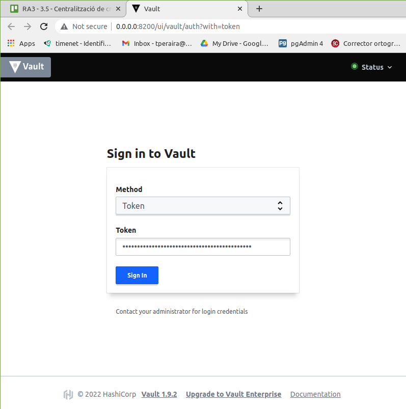
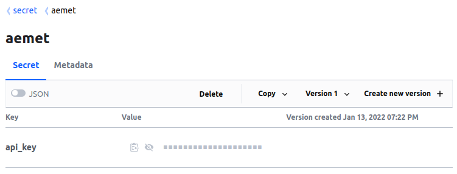
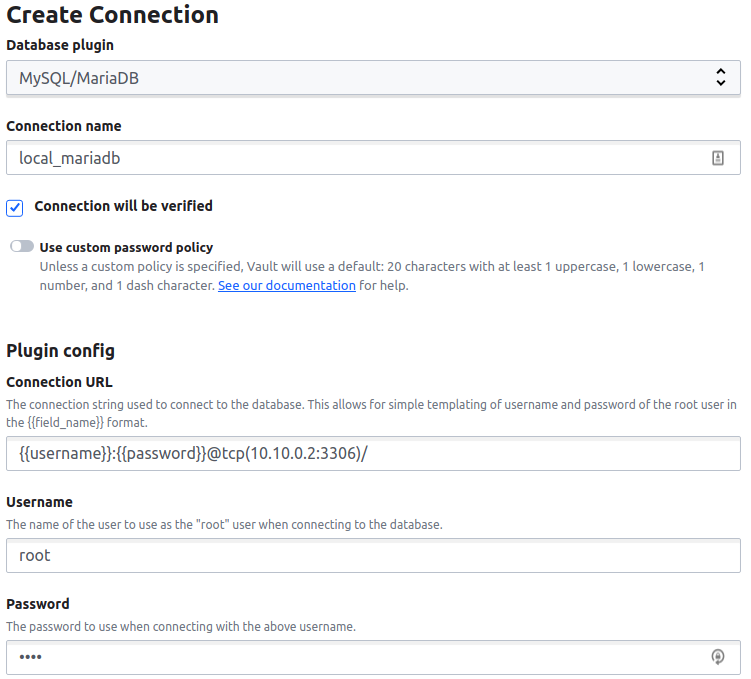

<!-----
title: "Centralització de credencials"
author: "Toni Peraira"
date: "2022-01-11"
version: "1.0"
geometry: left=2.54cm,right=2.54cm,top=2.54cm,bottom=2.54cm
header-right: '\headerlogo'
header-includes:
- '`\newcommand{\headerlogo}{\raisebox{0pt}[0pt]{\includegraphics[width=3cm]{../institut_montilivi.png}}}`{=latex}'
---

pandoc README.md -o Toni_Peraira_RA3_3.5.pdf --from markdown --template eisvogel --listings --pdf-engine=xelatex --toc -s -V toc-title:"Índex"
-->

# Centralització de credencials <!-- omit in toc -->

Instal·la i configura un servidor segur per a l'administració de credencials (tipus RADIUS - Remote Access Dial In User Service).

# Índex <!-- omit in toc -->

- [Desplega un servidor vault en docker al servidor ubuntu.](#desplega-un-servidor-vault-en-docker-al-servidor-ubuntu)
- [Entra dins de la interfície de vault i genera un recurs assignat a un usuari o servei](#entra-dins-de-la-interfície-de-vault-i-genera-un-recurs-assignat-a-un-usuari-o-servei)
- [Fes servir la API de vault per accedir a aquest recurs com si fossis aquest usuari o servei](#fes-servir-la-api-de-vault-per-accedir-a-aquest-recurs-com-si-fossis-aquest-usuari-o-servei)

## Desplega un servidor vault en docker al servidor ubuntu.

```console
docker run --name vault \
    -p 8200:8200 \
    -e 'VAULT_LOCAL_CONFIG={"backend": {"file": {"path": "/tmp/config.hcl"}}, "default_lease_ttl": "168h", "max_lease_ttl": "720h"}' \
    --cap-add=IPC_LOCK vault
```

```
You may need to set the following environment variable:

    $ export VAULT_ADDR='http://0.0.0.0:8200'

The unseal key and root token are displayed below in case you want to
seal/unseal the Vault or re-authenticate.

Unseal Key: fB4Zxlg3I/c+YwoYNnavxm0di/naI1xLuILDKFoBYr4=
Root Token: s.OBf0w0mI2h1MpMYOsMOJzuOp

Development mode should NOT be used in production installations!
```

## Entra dins de la interfície de vault i genera un recurs assignat a un usuari o servei



He creat un secret que és una API KEY de l'AEMET (Agència Estatal de Meteorologia) i les dades d'un servei MySQL/MariaDB que tinc en local.






## Fes servir la API de vault per accedir a aquest recurs com si fossis aquest usuari o servei

Obtenir AEMET API KEY:

```console
curl \
--header "X-Vault-Token: s.5FSc4tfVo0kbysi9bzKn8NxN" \
http://0.0.0.0:8200/v1/secret/data/aemet

> {"request_id":"7b7a3bbc-a16b-dbac-5cc9-1a39c9429b10","lease_id":"","renewable":false,"lease_duration":0,"data":{"data":{"aemet_api_key":"ax!%Q@UQWo8*o8$$Moz!TBX38ul*tusy"},"metadata":{"created_time":"2022-01-13T17:21:28.865537339Z","custom_metadata":null,"deletion_time":"","destroyed":false,"version":1}},"wrap_info":null,"warnings":null,"auth":null}
```

Obtenir dades MariaDB:

```console
curl \
--header "X-Vault-Token: s.5FSc4tfVo0kbysi9bzKn8NxN" \
http://0.0.0.0:8200/v1/database/config/local_mariadb

> {"request_id":"7e9c253f-451e-bce0-3c0e-373c9eac39f6","lease_id":"","renewable":false,"lease_duration":0,"data":{"allowed_roles":[],"connection_details":{"backend":"database","connection_url":"{{username}}:{{password}}@tcp(10.10.0.2:3306)/","max_connection_lifetime":"0s","max_idle_connections":0,"max_open_connections":4,"username":"root"},"password_policy":"","plugin_name":"mysql-database-plugin","root_credentials_rotate_statements":[]},"wrap_info":null,"warnings":null,"auth":null}
```